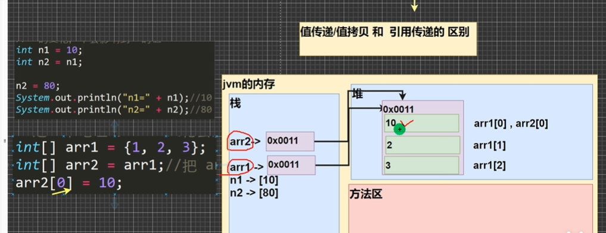
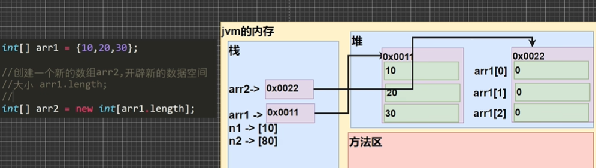
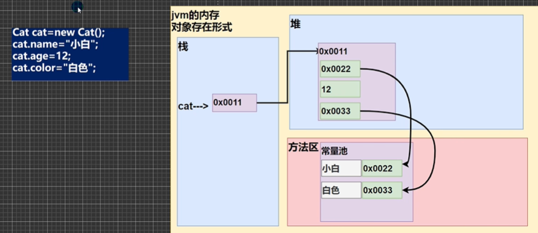
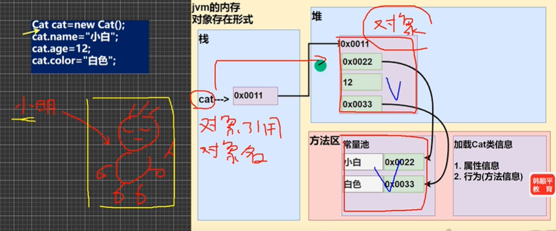
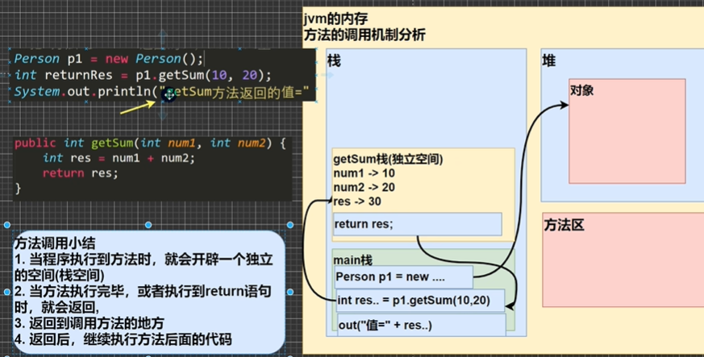

# ==  与  equals比较 以及 对象 创建 引用 本质
- == 对比的是栈中间的值，对于基本数据类型对比的是变量值(基本类型直接在栈中分配)，而引用类型对比的是指向堆中内存对象在栈中的地址<br>

Object
```java
public boolean euqals(Object obj) {
    return (this == obj);
}
```

- equals 如果不重写的话相当于object的比较 == 对比的是栈中间的值/引用类型对比地址<br>
  如果希望能够对比成员变量而不是对比地址 那么可以把equals重写

改写equals来比较String类型成员变量
```java
public boolean equals(Object anObject) {
    if (this == anObject) {
        return true;
    }
    if (anObject instanceOf String) {
        String anotherString = (String)anObject;
        int n = value.length;
        if (n == anotherString.value.length) {
            char v1[] = value; 
            char v2[] = anotherString.value;
            int i = 0;
            while (n-- != 0) {
                if (v1[i] != v2[i]) {
                    return false;
                }
                i++;
            }
            return true;
        }
    }
    return false;
}
```

### 尝试在以下代码中判断输出结果
```java
public class StringDemo {
    String str1 = "Hello";
    String str2 = new String("Hello");
    String str3 = str2;
    System.out.println(str1 == str2);   
    System.out.println(str1 == str3);
    System.out.println(str2 == str3);
    System.out.println(str1.equals(str2));
    System.out.println(str1.equals(str3));
    System.out.println(str2.equals(str3));
}
```


结果为
```
false
false
true
true
true
true
```

## 拷贝数据
与此相类似地，拷贝数组等引用数据类型和拷贝基本数据类型就存在着引用传递与值传递的区别
详细见下图

<p align="center"></p>

- 基本数据类型直接拷贝了栈中的值
- 而引用类型则是拷贝的栈所指向堆中的那个位置的地址
- 拷贝数组怎么做？ 要开辟新地址 长度为原来数组长度 然后逐个放过去 才能保证空间互相独立

<p align="center"></p> 

## 对象在内存中的存在形式
<p align="center"></p> 

- 一般而言，对象视同为引用数据类型 因此在栈中分配一个指向堆的地址
- 在堆中，对象的一系列属性可以看成是数组中的一个又一个元素  分别有一个位置
- 如果属性是基本数据类型 那么直接开辟一个地址在堆中放好
- 如果属性是引用数据类型 如字符串 那么堆中又会有一个地址索引的指向方法区中间的常量池 在那儿开辟新的地址存放对应的数据

## 谁是真正的对象？

<p align="center"></p> 

堆中和方法区里的部分是   栈中的只是对象引用或称之为对象名
- 小明本身是一个代号 不是一个人  
- 人是灵魂画手画的这个东西

- 创建对象的流程分析
```java
Person p = new Person();
p.name = "jack";
p.age = 10;
```
  - 先加载Person类的信息 （属性与方法）
  - 在堆中分配空间 进行默认的初始化  比如int定为0  string则在方法区定为null
  - 把地址赋给p  这样p就指向了对象
  - 把指定的初始化加上  p.name = "jack" 链接起来

## 如何调用方法

<p align="center"></p>

## 对象创建的流程分析
看一个案例
```java
class Person {
    int age = 90;
    String name;
    Person(String n, int a) {
        name = n;
        age = a;
    }
}

Person p = new Person('XiaoMing', 20);
```
- 首先加载Person类的信息(Person.class),**只会加载一次**
- 在堆中分配空间(地址)
- 完成对象的初始化  三部曲
  - 完成对象默认值的初始化
    - age = 0;
    - name = null;
  - 完成对象的显示初始化
    - age = 90;
    - name = null;
  - 构造器的初始化
    - age = 20;
    - name = 'XiaoMing';
- 对象在堆中分配的地址返回给p(p是对象名或称之为对象引用)


## hashcode与equals的联系
    - 若是两个对象相同，那么它们的hashcode一定相同（相同的对象一定经过相同的散列函数作用） --> 说明哈希函数不是随机函数 否则相同输入不具备相同输出  但是哈希函数有均匀性或称为离散性
    - hashcode相同的对象不一定相等

    - 若两对象相等，对两个对象分别调用equals方法都返回true
    - hashcode方法必须要被重写（equals重写了）
        - hashcode是对堆上元素产生独特值，若没有重写hashcode()，则该class两个对象无论如何都不会像等（即便它们指向相同的数据，引用地址不同，而不重写的话是比较地址，怎么会相等呢）
    - 一些相关的说明：
        - hashcode()作用是获取哈希码，返回一个int整数，确定对象在哈希表中的索引位置
        - hashcode定义在JDK的Object.java中，java中的任何类都能包含hashcode()函数。
        - HashSet结构如何查重？ --> 说明hashcode的意义
            - 对象加入HashSet的时候，HashSet先计算对象的hashcode值确定拟放入的位置是否被元素占据：
                - 若是该位置没有值，则HashSet会假设对象没有重复出现，放入当前元素（减少了equals的使用次数，如果没有hashcode需要跟每个放进HashSet的元素都去equals比较）
                - 此时若是该位置有值，这时会调用equals方法来检查两个对象是否真的内容上相同
                    - 若两者相同则HashSet拒绝加入当前新的元素
                    - 若两者不同则重新探查，散列安排去其他位置