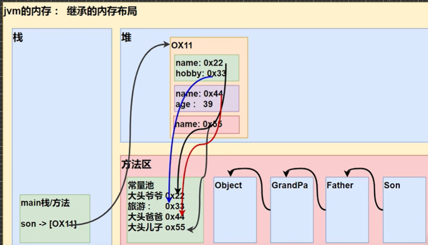

## 继承的细节
- 子类继承了所有的属性和方法，非私有的属性和方法可以直接访问  
  - 言下之意是 private的(私有)属性和private方法必须通过父类提供的公共方法访问
- 子类需要先用父类的构造器完成父类初始化(super() 会默认调用) 再做事
  - 也就是说子类调用无参构造器时 会默认地追溯到父类的无参构造器去调用一下
  - 如果父类没提供无参构造器 那么子类需要用super()专门指定用父类的哪个带参构造器初始化一个父类出来
- super()与this()都只能放在构造器的第一行  因此这两个方法不能共存在同一个构造器中
  - 用了super()就不能用this() 反之 用了this()也就没有了super()
  - this() 是怎么用的? 比如在本类的无参构造器中加一句this("xxx")就可以调用本类的带一个String的有参构造器 诸如此类
- 父类构造器的调用不限于直接父类  将一直向上追溯到Object顶级父类
- 单继承 子类只能继承一个父类  
  - 如果要让A继承B类和C类  那么可以让A继承B B继承C
- 子类 is a 父亲  这个逻辑关系需要满足
- 调用具体的属性的时候呢 首先找子类有没有 如果没有再往父类 依此类推向上追溯

<p align="center"></p> 

## 继承在内存中的本质
```java
public class ExtendsTheory {
    public static void main(String[] args) {
        Son son = new Son();  // 内存布局是怎样的       
    }
}

class GrandPa {
    String name = "大头爷爷";
    String hobby = "旅游";
}

class Father extends GrandPa {
    String name = "大头爸爸";
    int age = 39;
}

class Son extends Father {
    String name = "大头儿子";
}
```
- 首先加载son的类信息
  - 首先加载Object类信息 然后是加载爷类  然后加载父类  最后加载son类信息
- 堆中分配空间
  - 爷爷类的name和hobby分配到 ==> 父类的name和age分配到(不会重叠 开新的空间) ==> 子类分配到
- 而后完成数据的初始化 三部曲  默认值--显示初始化--构造器初始化
- 把堆中分配到的地址返回给对象

<p align="center"></p> 


## 继承顺序举例理解
```java
class A {
  public A() {
    System.out.printin("我是A类");
  }
}

class B extends A{ //B类,继承A类
  public B{
    System.out.printin("我是B类形无参构造");
  }
  public B(String name) {
    System.out.println(name + "我是B类的有参构造");
  }
}

class C extends B{
  public C() {
    this("hello");
    System.out.println("我是c类的无参构造");
  }
  public C(String name){
    super("hahah");
    System.out.println("我是c类的有参构造");
  }
}


C c = new C();
```
输出内容

我是A类<br/>
hahah我是B类的有参构造<br/>
我是C类的有参构造<br/>
我是C类的无参构造
