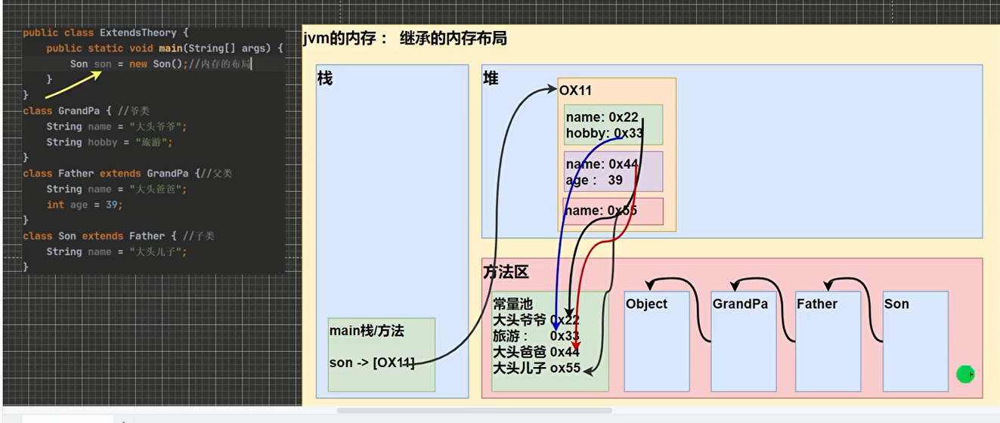

## 继承的细节
- 子类继承了所有的属性和方法，非私有的属性和方法可以直接访问  
  - 言下之意是 private的(私有)属性和private方法必须通过父类提供的公共方法访问
- 子类需要先用父类的构造器完成父类初始化(super() 会默认调用) 再做事
  - 如果父类没提供无参构造器 那么子类需要用super()专门指定用父类的哪个带参构造器初始化一个父类出来
- 父类构造器的调用不限于直接父类  将一直向上追溯到Object顶级父类
- 单继承 子类只能继承一个父类  
- 子类 is a 父亲  这个逻辑关系需要满足

 

